# 🎬 Algorithm Demonstrations

The following GIFs demonstrate the execution process of each implemented search algorithm.

---

## 📚 Uninformed Search

<table align="center">
<tr>
<td align="center">

### Breadth-First Search (BFS)

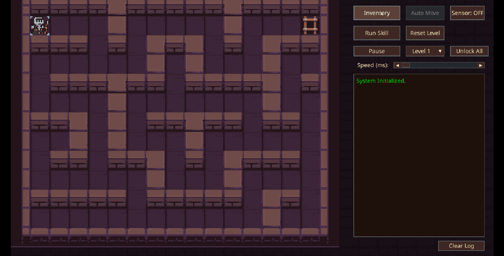

</td>

<td align="center">

### Depth-First Search (DFS)

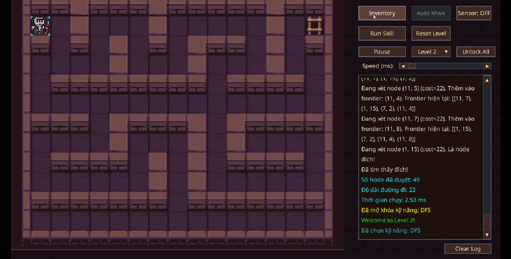

</td>
</tr>
</table>

---

## 🎯 Informed Search

<table align="center">
<tr>
<td align="center">

### Greedy Best-First Search

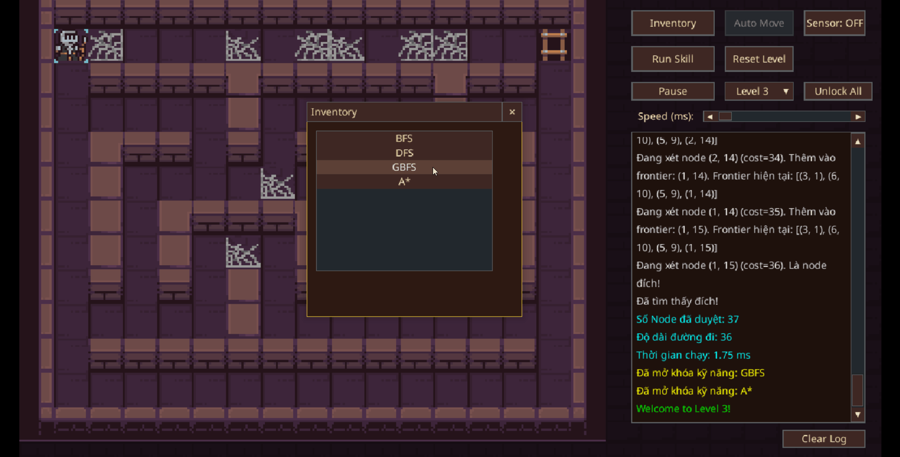

</td>

<td align="center">

### A* Search

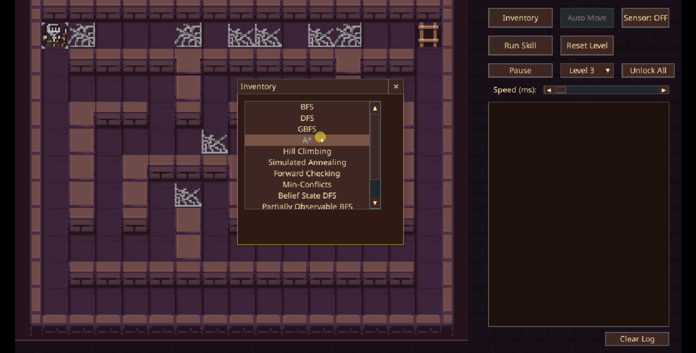

</td>
</tr>
</table>

---

## 🏔️ Local Search

<table align="center">
<tr>
<td align="center">

### Hill Climbing

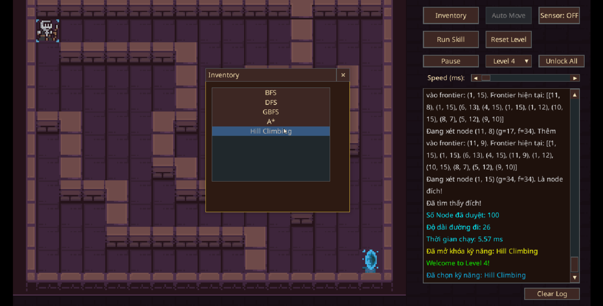

</td>

<td align="center">

### Simulated Annealing

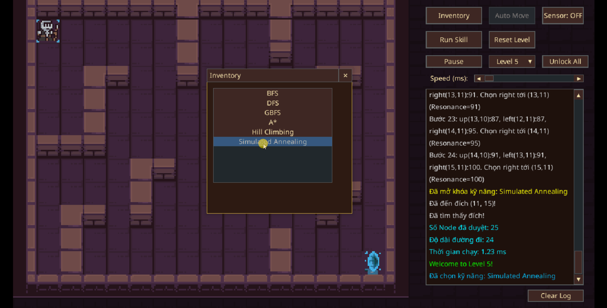

</td>
</tr>
</table>

---

## 🌍 Complex Environment Search

<table align="center">
<tr>
<td align="center">

### Belief State DFS

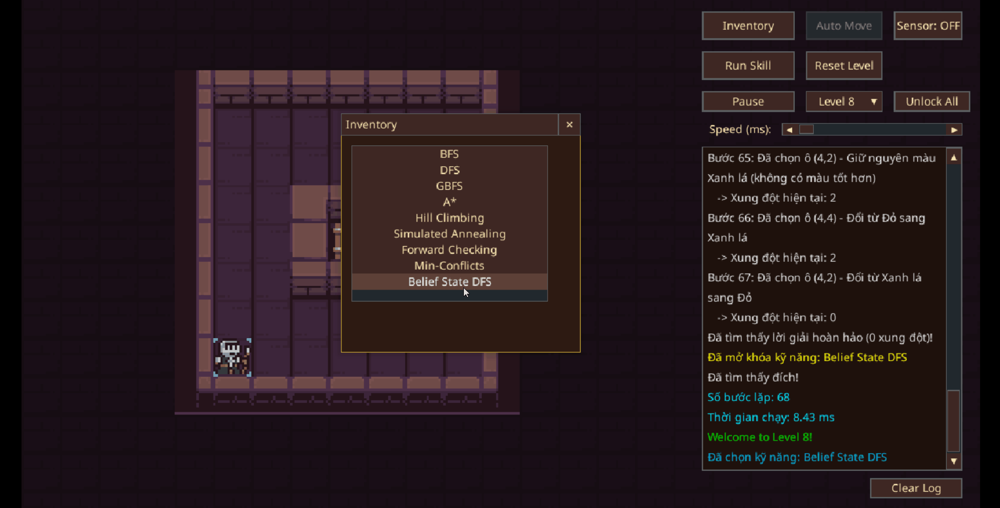

</td>

<td align="center">

### Partially Observable BFS

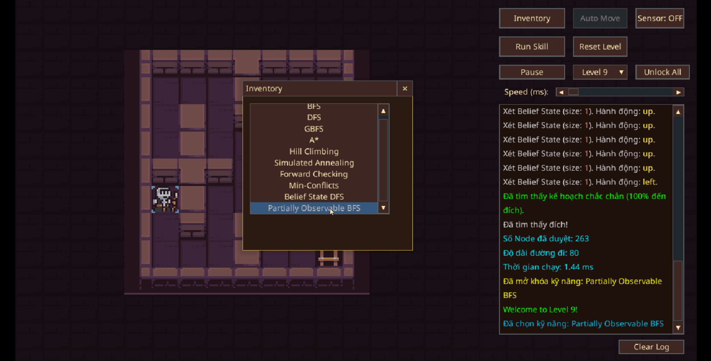

</td>
</tr>
</table>

---

## 🧩 Constraint Satisfaction Problems (CSP)

<table align="center">
<tr>
<td align="center">

### Forward Checking

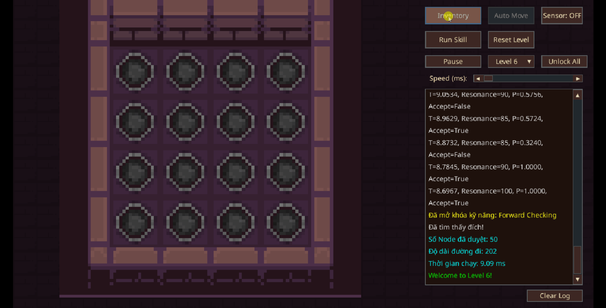

</td>

<td align="center">

### Min-Conflict

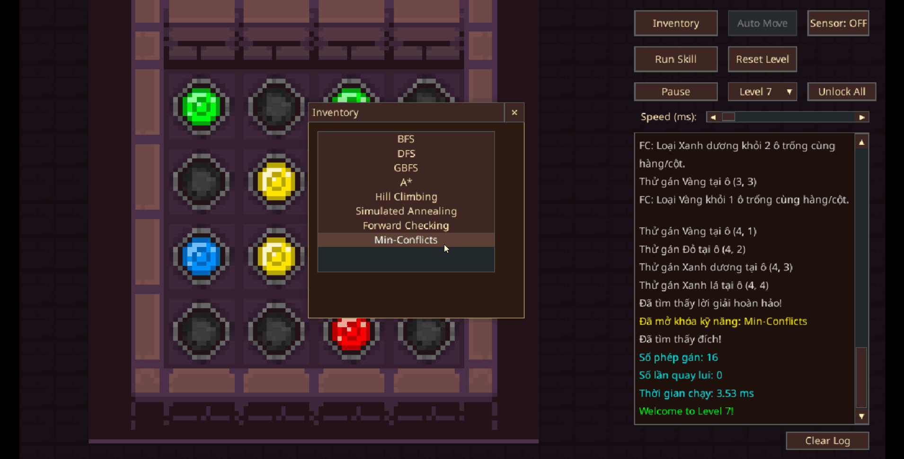

</td>
</tr>
</table>

---

## ♟️ Adversarial Search

<table align="center">
<tr>
<td align="center">

### Alpha-Beta Pruning

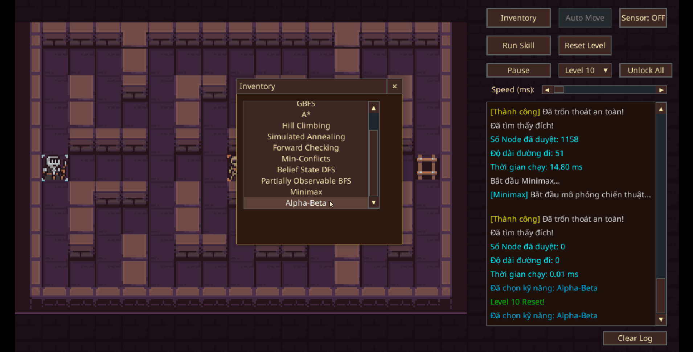

</td>

<td align="center">

### Minimax

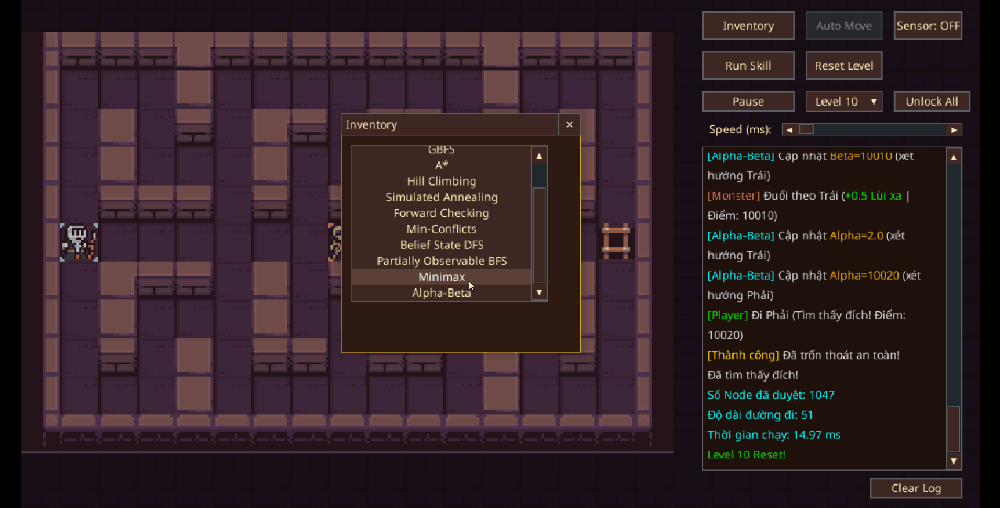

</td>
</tr>
</table>
